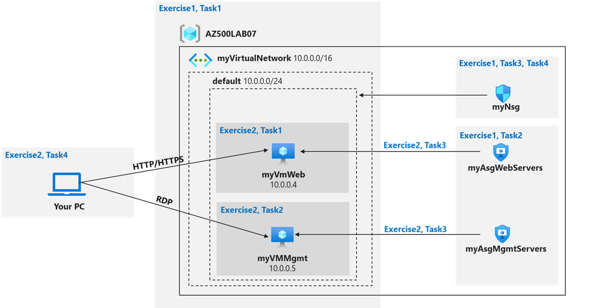

---
lab:
  title: 02 - 網路安全性群組和應用程式安全性群組
  module: Module 01 - Plan and implement security for virtual networks
---

# 實驗室 02：網路安全性群組和應用程式安全性群組
# 學生實驗室手冊

## 實驗案例

您必須實作組織的虛擬網路基礎結構並進行測試，確保其能正常運作。 特別是：

- 組織有兩組伺服器：網頁伺服器和管理伺服器。
- 各組伺服器必須位於自己所屬的應用程式安全性群組中。 
- 您應該能夠透過 RDP 連入管理伺服器，但不能連入網頁伺服器。
- 透過網際網路存取時，網頁伺服器應該會顯示 IIS 網頁。 
- 必須使用網路安全性群組規則控管網路存取。 

> 此實驗室中所有資源均使用**美國東部**區域。 請與講師驗證這是課程中要使用的區域。 

## 實驗室目標

在本實驗室中，您將完成下列練習：

- 練習 1：建立虛擬網路基礎結構
- 練習 2：部署虛擬機器並測試網路篩選

## 網路和應用程式安全性群組圖表



## 指示

### 練習 1：建立虛擬網路基礎結構

### 預估時間：20 分鐘

> 此實驗室中所有資源均使用**美國東部**區域。 請與講師確認這是課程中要使用的區域。 

在本練習中，您將會完成下列工作：

- 工作 1：建立具有一個子網路的虛擬網路。
- 工作 2：建立兩個應用程式安全性群組。
- 工作 3：建立一個網路安全性群組，並與虛擬網路子網路建立關聯。
- 工作 4：針對連入網頁伺服器的所有流量建立輸入 NSG 安全性規則，並針對管理伺服器建立 RDP。

#### 工作 1：建立虛擬網路

在此工作中，您必須建立要與網路及應用程式安全性群組搭配使用的虛擬網路。 

1. 登入 Azure 入口網站：**`https://portal.azure.com/`**。

    >**注意**：登入 Azure 入口網站時使用的帳戶，必須在您用於這個實驗室的 Azure 訂用帳戶中具有「擁有者」或「參與者」角色。

2. 在 Azure 入口網站 的 Azure 入口網站 頁面頂端的 [搜尋資源、服務和文件 **] **文字方塊中，輸入 +++虛擬網路+++，然後按 **Enter** 鍵。

3. 在 [虛擬網路]**** 刀鋒視窗中，按一下 [+ 建立]****。

4. 在 [建立虛擬網路]**** 刀鋒視窗的 [基本]**** 索引標籤上，指定下列設定 (將其他設定保留為預設值)，然後按 [下一步：**IP 位址]**：

    |設定|值|
    |---|---|
    |訂用帳戶 | 您在此實驗室中使用的 Azure 訂用帳戶名稱 |
    |資源群組 | 使用名為 AZ500LAB07 的 **提供的資源群組** |
    |名稱| +++我的虛擬網路+++ |
    |區域| **美國東部** |

5. 在 [建立虛擬網路]**** 刀鋒視窗的 [IP 位址]**** 索引標籤上，將 [IPv4 位址空間]**** 設定為 **10.0.0.0/16**。如有需要，請在 [子網路名稱]**** 資料行中按一下 [預設]****，然後在 [編輯子網路]**** 刀鋒視窗中指定下列設定，並點選 [儲存]****：

    |設定|值|
    |---|---|
    |子網路名稱|**預設值**|
    |子網路位址範圍|**10.0.0.0/24**|

6. 回到 [建立虛擬網路] 畫面的 [IP 位址] **索引標籤，按一下 **[** 檢閱 + 建立**]。****

7. 在 [建立虛擬網路 **] 畫面的 [**檢閱 + 建立**] 索引標籤上，按一下 **[建立]。****

#### 工作 2：建立應用程式安全性群組

在此工作中，您必須建立一個應用程式安全性群組。

1. 在 Azure 入口網站 的 [搜尋資源、服務和文件] 文字方塊中，輸入 Azure 入口網站頁面頂端的 [**搜尋資源、服務和文件**] 文字方塊，然後按 **Enter** 鍵。

2. 在 [應用程式安全性群組]**** 刀鋒視窗中按一下 [+ 建立]****。

3. 在 [建立應用程式安全性群組]**** 刀鋒視窗的 [基本]**** 索引標籤上，指定下列設定： 

    |設定|值|
    |---|---|
    | 資源群組 | **AZ500LAB07** |
    | 名稱 | +++myAsgWeb伺服器+++ |
    | 區域 | **美國東部** |

    >**注意**：此群組為網頁伺服器群組。

4. 按一下 [檢閱 + 建立]  ，然後按一下 [建立]  。

5. 返回 [應用程式安全性群組]**** 刀鋒視窗，然後按一下 [+ 建立]****。

6. 在 [建立應用程式安全性群組]**** 刀鋒視窗的 [基本]**** 索引標籤上，指定下列設定： 

    |設定|值|
    |---|---|
    |資源群組|**AZ500LAB07**|
    |名稱| +++myAsgMgmt伺服器+++ |
    |區域|**美國東部**|

    >**注意**：此群組為管理伺服器群組。

7. 按一下 [檢閱 + 建立]  ，然後按一下 [建立]  。

#### 工作 3：建立一個網路安全性群組，使之與子網路建立關聯

在此工作中，您必須建立一個網路安全性群組。 

1. 在 Azure 入口網站 的 [搜尋資源、服務和文件] 文字方塊中，輸入 Azure 入口網站頁面頂端的 [**搜尋資源、服務和文件**] 文字方塊，然後按 **Enter** 鍵。

2. 在 [網路安全性群組]**** 刀鋒視窗中，按一下 [+ 建立]****。

3. 在 [建立網路安全性群組]**** 刀鋒視窗的 [基本]**** 索引標籤上，指定下列設定： 

    |設定|值|
    |---|---|
    | 訂用帳戶 | 您在此實驗室中使用的 Azure 訂用帳戶名稱 |
    | 資源群組 | **AZ500LAB07** |
    | 名稱 | +++我的Nsg+++ |
    | 區域 | **美國東部** |

4. 按一下 [檢閱 + 建立]  ，然後按一下 [建立]  。

5. 在 Azure 入口網站 中，流覽回 [網路安全性群組 **] **刀鋒視窗，然後選取 **myNsg** 專案。 或選取 [移至資源 **] （** 如果有的話）。

6. 在 myNsg **** 刀鋒視窗的 [設定 **] **區段中，按一下 [**子網路]**，然後選取 [**+ 關聯]。** 

7. 在 [ 關聯子網路** ] **刀鋒視窗上，指定下列設定，然後選取 [ **確定**]：

    |設定|值|
    |---|---|
    |虛擬網路|**myVirtualNetwork**|
    |子網路|**預設值**|

#### 工作 4：針對連入 Web 伺服器的所有流量建立輸入 NSG 安全性規則，並以 RDP 方式連線到那些伺服器。 

1. 在 [myNsg]**** 刀鋒視窗的 [設定]**** 區段按一下 [輸入安全性規則]****。

2. 檢閱預設的輸入安全性規則，然後按一下 [+ 新增]****。

3. 在 [新增輸入安全性規則]**** 刀鋒視窗中指定下列設定，允許 TCP 通訊埠 80 和 443 連至 **myAsgWebServers** 應用程式安全性群組 (其他值請保留預設值)： 

    |設定|值|
    |---|---|
    | 來源 | **任何** |
    | 來源連接埠範圍 | * |
    |Destination|在下拉式清單中選取 [應用程式安全性群組]****，然後按一下 [myAsgWebServers]****|
    | 服務 | **自訂** |
    |目的地連接埠範圍|**80,443**|
    |通訊協定|**TCP**|
    | 動作 | **允許** |
    |優先順序|**100**|
    |名稱|**Allow-Web-All**|

4. 選取 [新增輸入安全性規則 **] **頁面上的 [**新增**] 按鈕，以建立新的輸入規則。

5. 在 [myNsg]**** 刀鋒視窗的 [設定]**** 區段按一下 [輸入安全性規則]****，然後點選 [+ 新增]****。

6. 在 [新增輸入安全性規則]**** 刀鋒視窗中指定下列設定，允許 RDP 通訊埠 (TCP 3389) 連至 **myAsgMgmtServers** 應用程式安全性群組 (其他值請保留預設值)： 

    |設定|值|
    |---|---|
    | 來源 | **任何** |
    | 來源連接埠範圍 | * |
    |Destination|在下拉式清單中選取 [應用程式安全性群組]****，然後按一下 [myAsgMgmtServers]****|
    | 服務 | **自訂** |
    |目的地連接埠範圍|**3389**|
    |通訊協定|**TCP**|
    | 動作 | **允許** |
    |優先順序|**110**|
    |名稱|**Allow-RDP-All**|

7. 選取 **** 新增輸入安全性規則** 頁面**上的新增，以建立新的輸入規則。 

> 結果：您已部署虛擬網路、具有輸入安全性規則的網路安全性，以及兩個應用程式安全性群組。 

### 練習 2：部署虛擬機器並測試網路篩選器

### 預估時間：25 分鐘

在本練習中，您將會完成下列工作：

- 工作 1：建立要當作網頁伺服器使用的虛擬機器。
- 工作 2：建立要當作管理伺服器使用的虛擬機器。
- 工作 3：為每個虛擬機器網路介面及其應用程式安全性群組建立關聯。
- 工作 4：測試網路流量篩選。

#### 作業 1：建立虛擬機器以用作 Web 伺服器

在此工作中，您必須建立要當作網頁伺服器使用的虛擬機器。

1. 在 Azure 入口網站 的 Azure 入口網站 頁面頂端的 [**搜尋資源、服務和檔**] 文字方塊中，輸入 +++虛擬機器+++，然後按 **Enter** 鍵。

2. 在 [虛擬機器]**** 刀鋒視窗中按一下 [+ 建立]****，然後在下拉式清單中點選 [+ Azure 虛擬機器]****。

3. 在 [建立虛擬機器] 刀鋒視窗的 [基本] 索引標籤上，指定下列設定 (將其他設定保留為預設值)：

   |設定|值|
   |---|---|
   |訂用帳戶|您要在此實驗室中使用的 Azure 訂閱名稱|
   |資源群組|**AZ500LAB07**|
   |虛擬機器名稱|**myVmWeb**|
   |區域|**(美國) 美國東部**|
   |可用性選項|**不需要基礎結構備援**
   |安全性類型|**標準**
   |映像|**Windows Server 2022 Datacenter：Azure Edition- x64 Gen2**|
   |大小|**標準 D2s v3**|
   |使用者名稱|**Student**|
   |密碼|**請建立您自己的密碼，並將它記錄為後續實驗室中的參考**|
   |確認密碼|**重新輸入您的密碼**|
   |公用輸入連接埠|**None**|
   |您要使用現有的 Windows Server 授權嗎 |**否**|

    >**注意**：針對公用輸入連接埠，我們會依賴預先建立的 NSG。 

5. 按一下 [下一步：**磁碟 >]**，然後在 [建立虛擬機器]**** 刀鋒視窗的 [磁碟]**** 索引標籤上，將 [OS 磁碟類型]**** 設為 [標準 HDD]****，再按 [下一步：**網路 >]**。

6. 在 [建立虛擬機器]**** 刀鋒視窗的 [網路]**** 索引標籤上，選取先前建立的網路 **myVirtualNetwork**。

7. 在 [NIC 網路安全性群組]**** 下方選取 [無]****。

8. 按一下 [下一步：**管理 >**，然後按一下 **[下一步]：監視 >**。 在 [建立虛擬機器]**** 刀鋒視窗的 [監視]**** 索引標籤上確認以下設定：

   |設定|值|
   |---|---|
   |開機診斷|**使用受控儲存體帳戶啟用 (建議使用)**|

9. 在 [檢閱 + 建立]**** 刀鋒視窗中按一下 [檢閱 + 建立]****，確定驗證成功後再點選 [建立]****。

#### 工作 2：建立要當作管理伺服器使用的虛擬機器。 

在此工作中，您必須建立要當作管理伺服器使用的虛擬機器。

1. 在 Azure 入口網站中返回 [虛擬機器]**** 刀鋒視窗，按一下 [+ 建立]****，然後在下拉式清單中點選 [+ Azure 虛擬機器]****。

2. 在 [建立虛擬機器] 刀鋒視窗的 [基本] 索引標籤上，指定下列設定 (將其他設定保留為預設值)：

   |設定|值|
   |---|---|
   |訂用帳戶|您要在此實驗室中使用的 Azure 訂閱名稱|
   |資源群組|**AZ500LAB07**|
   |虛擬機器名稱|**myVMMgmt**|
   |區域|(美國) 美國東部|
   |可用性選項|**不需要基礎結構備援**
   |安全性類型|**標準**
   |映像|**Windows Server 2022 Datacenter：Azure Edition - x64 Gen2**|
   |大小|**標準 D2s v3**|
   |使用者名稱|**Student**|
   |密碼|**請使用您在實驗室 02 > 練習 2 > 工作 1 > 步驟 3 中建立的個人密碼。**|
   |公用輸入連接埠|**None**|
   |已經有 Windows Server 授權了嗎|**否**|

    >**注意**：針對公用輸入連接埠，我們會依賴預先建立的 NSG。 

4. 按一下 [下一步：**磁碟 >]**，然後在 [建立虛擬機器]**** 刀鋒視窗的 [磁碟]**** 索引標籤上，將 [OS 磁碟類型]**** 設為 [標準 HDD]****，再按 [下一步：**網路 >]**。

5. 在 [建立虛擬機器]**** 刀鋒視窗的 [網路]**** 索引標籤上，選取先前建立的網路 **myVirtualNetwork**。

6. 在 [NIC 網路安全性群組]**** 下方選取 [無]****。

7. 按一下 [下一步：**管理 >**，然後按一下 **[下一步]：監視 >**。 在 [建立虛擬機器]**** 刀鋒視窗的 [監視]**** 索引標籤上確認以下設定：

   |設定|值|
   |---|---|
   |開機診斷|**使用受控儲存體帳戶啟用 (建議使用)**|

8. 在 [檢閱 + 建立]**** 刀鋒視窗中按一下 [檢閱 + 建立]****，確定驗證成功後再點選 [建立]****。

    >**注意**：請等待這兩個虛擬機器佈建完畢後再繼續操作。 

#### 工作 3：為每個虛擬機器網路介面及其應用程式安全性群組建立關聯。

在此工作中，您必須將每個虛擬機器網路介面與對應的應用程式安全性群組建立關聯。 myVMWeb 虛擬機器介面須與 myAsgWebServers ASG 建立關聯。 myVMMgmt 虛擬機器介面須與 myAsgMgmtServers ASG 建立關聯。 

1. 在 Azure 入口網站中返回 [虛擬機器]**** 刀鋒視窗，確認兩個虛擬機器的狀態皆為 **「正在執行」**。

2. 在虛擬機器清單中，按一下 **myVMWeb** 項目。

3. 在 [myVMWeb]**** 刀鋒視窗的 [網路]**** 區段按一下 [網路設定]****，然後在 [myVMWeb \| 網路設定]**** 刀鋒視窗中點選 [應用程式安全性群組]**** 索引標籤。

4. 按一下 + [新增應用程式安全性群組]****，然後在 [應用程式安全性群組]**** 清單中選取 [myAsgWebServers]****，再按一下 [儲存]****。

5. 返回 [虛擬機器]**** 刀鋒視窗，然後在虛擬機器清單中，按一下 **myVMMgmt** 項目。

6. 在 [myVMMgmt]**** 刀鋒視窗的 [網路]**** 區段按一下 [網路設定]****，然後在 [myVMMgmt \| 網路設定]**** 刀鋒視窗中點選 [應用程式安全性群組]**** 索引標籤。

7. 按一下 + [新增應用程式安全性群組]****，然後在 [應用程式安全性群組]**** 清單中選取 [myAsgMgmtServers]****，再按一下 [儲存]****。

#### 工作 4：測試網路流量篩選

在此工作中，您會測試網路流量篩選器。 您必須能夠透過 RDP 連線至 myVMMgmnt 虛擬機器。 您必須能夠從網際網路連線至 myVMWeb 虛擬機器，並看到預設的 IIS 網頁。  

1. 返回 [myVMMgmt]**** 虛擬機器刀鋒視窗。

2. 在 [**myVMMgmt** 概觀] 刀鋒視窗上，按一下 [連線 **]，然後**在下拉式功能表中按一下 **[連線**]。 

3. 下載 RDP 檔案，並使用它透過遠端桌面連線到 **myVMMgmt** Azure VM。 出現驗證提示時，請提供下列認證：

   |設定|值|
   |---|---|
   |使用者名稱|**Student**|
   |密碼|**請使用您在實驗室 02 > 練習 1 > 工作 1 > 步驟 9 中建立的個人密碼。**|

    >**注意**：請確認遠端桌面連線成功。 此時您已確認可以透過遠端桌面連線至 myVMMgmt。

4. 在 Azure 入口網站中前往 [myVMWeb]**** 虛擬機器刀鋒視窗。

5. 在 [myVMWeb]**** 刀鋒視窗的 [作業]**** 區段按一下 [執行命令]****，然後點選 [RunPowerShellScript]****。

6. 在 [執行命令指令碼]**** 窗格中執行下列命令，以便在 **myVmWeb** 上安裝網頁伺服器角色：

    ```powershell
    Install-WindowsFeature -name Web-Server -IncludeManagementTools
    ```

    >**注意**：等候安裝完成。 這可能需要幾分鐘。 此時您可以驗證是否能透過 HTTP/HTTPS 存取 myVMWeb。

7. 在Azure 入口網站中返回 [myVMWeb]**** 刀鋒視窗。

8. 在 [myVMWeb]**** 刀鋒視窗中找出 myVmWeb Azure 虛擬機器的**公用 IP 位址**。

9. 開啟另一個瀏覽器分頁，前往您在上一個步驟找到的 IP 位址。

    >**注意**：瀏覽器分頁應顯示預設的 IIS 歡迎頁面，因為根據 **myAsgWebServers** 應用程式安全性群組的設定，連接埠 80 已取得從網際網路輸入的許可。 myVMWeb Azure 虛擬機器的網路介面已與該應用程式安全性群組建立關聯。 

> 結果：您已確認 NSG 與 ASG 設定可正常運作，且流量也能受到正確管理。 

**清除資源**

> 請記得移除您不再使用的任何新建立的 Azure 資源。 移除未使用的資源可避免產生非預期的費用。 

1. 按一下 Azure 入口網站右上方的第一個圖示，開啟 Cloud Shell。 如果出現提示，請選取 [PowerShell]**** 與 [建立儲存體]****。

2. 確認在 [Cloud Shell] 窗格左上角的下拉式功能表中，已選取 [PowerShell]****。

3. 在 [Cloud Shell] 窗格的 PowerShell 工作階段中，執行下列操作，移除您在此實驗室中建立的資源群組：
  
    ```powershell
    Remove-AzResourceGroup -Name "AZ500LAB07" -Force -AsJob
    ```

4.  關閉 [Cloud Shell] 窗格。 
