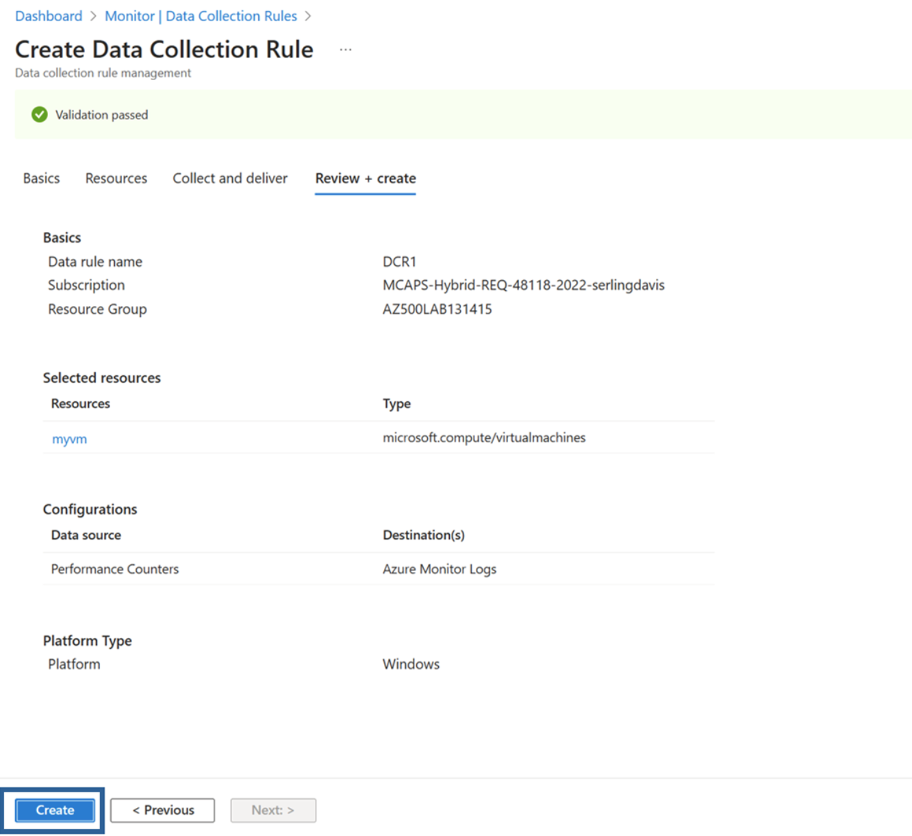

---
lab:
  title: 08 - 建立 Log Analytics 工作區、Azure 儲存體帳戶和資料收集規則 （DCR）
  module: Module 03 - Configure and manage threat protection by using Microsoft Defender for Cloud
---

# 實驗室 08：建立 Log Analytics 工作區、Azure 儲存體帳戶和資料收集規則 （DCR）

# 學生實驗室手冊

## 實驗案例

身為金融科技公司的 Azure 安全性工程師，您的任務是增強用於處理金融交易和管理敏感性客戶資料的所有 Azure 虛擬機器 （VM） 的監視和安全可見度。 安全團隊需要這些虛擬機器的詳細日誌和效能指標，以偵測潛在威脅並優化系統效能。 資訊安全長 （CISO） 已要求您實作收集安全性事件、系統記錄和效能計數器的解決方案。 您已被指派來設定 Azure 監視器代理程式 （AMA） 以及資料收集規則 （DCR） ，以集中記錄收集和效能監視。


> 此實驗室中所有資源均使用**美國東部**區域。 請與講師驗證這是課程中要使用的區域。 

## 實驗室目標

在本實驗室中，您將完成下列練習：

- 練習 1：部署 Azure 虛擬機器
- 練習 2：建立 Log Analytics 工作區
- 練習 3：建立 Azure 儲存體帳戶
- 練習 4：建立資料整理規則
  
## 指示

### 練習 1：部署 Azure 虛擬機器

### 練習時間：10 分鐘

在本練習中，您將會完成下列工作： 

#### 工作 1：部署 Azure 虛擬機器

1. 登入 Azure 入口網站：**`https://portal.azure.com/`**。

    >**注意**：登入 Azure 入口網站時使用的帳戶，必須在您用於這個實驗室的 Azure 訂用帳戶中具有「擁有者」或「參與者」角色。

2. 按一下 Azure 入口網站右上方的第一個圖示，開啟 Cloud Shell。 如果出現提示，請選取 [ **PowerShell**]。

3. 確認在 [Cloud Shell] 窗格左上角的下拉式功能表中，已選取 [PowerShell]****。

4. 在 [ **開始使用** ] 視窗中，將預設設定保留為原樣： **選取要開始使用的訂用帳戶。您可以選擇性地掛接儲存體帳戶，以在工作階段之間保存檔案。不需要儲存體帳戶。**

5. 從 訂閱** 下拉式選單中**，選擇您的 **lodsubscription。**

6. 保留未核取 [使用現有的私人虛擬網路 **]**，然後按一下 [**套用]。**

7. 在 [Cloud Shell] 窗格的 PowerShell 工作階段中執行下列指令，建立您要在此實驗室中使用的資源群組：
  
    ```powershell
    New-AzResourceGroup -Name AZ500LAB131415 -Location 'EastUS'
    ```

    >**附註**： 此資源群組將用於實驗室 8、9 和 10。

8. 在 Cloud Shell 窗格內的 PowerShell 工作階段中，執行下列命令以在主機上啟用加密 ((EAH))
   
   ```powershell
    Register-AzProviderFeature -FeatureName "EncryptionAtHost" -ProviderNamespace Microsoft.Compute 
    ```

5. 在 [Cloud Shell] 窗格的 PowerShell 工作階段中，執行下列命令以建立新的 Azure 虛擬機器。 

    ```powershell
    New-AzVm -ResourceGroupName "AZ500LAB131415" -Name "myVM" -Location 'EastUS' -VirtualNetworkName "myVnet" -SubnetName "mySubnet" -SecurityGroupName   "myNetworkSecurityGroup" -PublicIpAddressName "myPublicIpAddress" -PublicIpSku Standard -OpenPorts 80,3389 -Size Standard_D2s_v3 
    ```
    
6.  出現憑據提示時：

    |設定|值|
    |---|---|
    |User |**localadmin**|
    |密碼|**請使用您在實驗室 02 > 練習 2 > 工作 1 > 步驟 3 中建立的個人密碼。**|

    >**注意**：等待部署完成。 

7. 在 [Cloud Shell] 窗格的 PowerShell 工作階段中執行下列命令，確認名為 **myVM** 的虛擬機器已順利建立，且 **ProvisioningState** 為 **「已成功」**。

    ```powershell
    Get-AzVM -Name 'myVM' -ResourceGroupName 'AZ500LAB131415' | Format-Table
    ```

8. 關閉 [Cloud Shell] 窗格。 

### 練習 2：建立 Log Analytics 工作區

### 練習時間：10 分鐘

在本練習中，您將會完成下列工作： 

#### 工作 1：建立 Log Analytics 工作區

在此工作中，您必須建立 Log Analytics 工作區。 

1. 在 Azure 入口網站分頁頂端的 [搜尋資源、服務及文件] **** 文字輸入框中輸入 **「Log Analytics 工作區」**，然後按下 **Enter** 鍵。

2. 在 [Log Analytics 工作區]**** 刀鋒視窗上，按一下 [+ 建立] ****。

3. 在 [建立 Log Analytics 工作區]**** 刀鋒視窗的 [基本]**** 索引標籤上，指定下列設定 (其他設定請保留預設值)：

    |設定|值|
    |---|---|
    |訂用帳戶|您要在此實驗室中使用的 Azure 訂用帳戶名稱|
    |資源群組|**AZ500LAB131415**|
    |名稱|任何有效的全域唯一名稱|
    |區域|**美國東部**|

4. 選取 [**檢閱 + 建立**]。

5. 在 [建立 Log Analytics 工作區]**** 刀鋒視窗的 [檢閱 + 建立]**** 索引標籤上，選取 [建立]****。

### 練習 3：建立 Azure 儲存體帳戶

### 預計時間：10 分鐘

在本練習中，您將會完成下列工作：

#### 工作 1：建立 Azure 儲存體帳戶

在此工作中，您將建立儲存體帳戶。

1. 在 Azure 入口網站頁面頂端的 [搜尋資源、服務及文件] **** 文字輸入框中輸入**儲存體帳戶**，然後按下 **Enter** 鍵。

2. 在 Azure 入口網站的 [儲存體帳戶]**** 刀鋒視窗中，按一下 [+ 建立]**** 按鈕來建立新的儲存體帳戶。

3. 在 [建立儲存體帳戶] 窗格的 [基本] 索引標籤上，指定下列設定 (將其他設定保留為預設值)：

    |設定|值|
    |---|---|
    |訂用帳戶|您要在此實驗室中使用的 Azure 訂用帳戶名稱|
    |資源群組|**AZ500LAB131415**|
    **執行個體詳細資料** |儲存體帳戶名稱|長度介於 3 到 24 之間的任何全域唯一名稱，由字母和數字組成| |地區|**（美國）美國東部**|
    |主要服務|**Azure Blob 儲存體或 Azure Data Lake Storage Gen 2**|
   |性能|**標準 （一般用途 v2 帳戶）**|
    |冗餘|**本機備援儲存體 （LRS）**|

5. 在 [建立儲存體帳戶 **] 刀鋒視窗的 [**基本]** 索引標籤上，按一下 [**檢閱 + **建立]。** 驗證程序完成後，按一下 **建立。**

    >**注意**：等候儲存體帳戶建立完成。 這應該大約需要 2 分鐘的時間。

### 練習 4：建立資料收集規則

### 預計時間：15 分鐘

在本練習中，您將會完成下列工作：

#### 工作 1：建立資料收集規則。

在此工作中，您將建立資料收集規則。

1. 在 Azure 入口網站中，於 Azure 入口網站頁面頂端的 [搜尋資源、服務和文件]**** 文字輸入框中，輸入 [監視器]****，然後按 **Enter** 鍵。

2. 在 [監視器設定]**** 刀鋒視窗上，按一下 [資料收集規則] ****。

3. 按一下 + 建立**按鈕**以建立新的資料收集規則。

4. 在 [建立資料收集規則]**** 刀鋒視窗的 [基本]**** 索引標籤上，指定下列設定：
  
    |設定|值|
    |---|---|
    **規則詳細資料** |規則名稱|**DCR1**|
    的 |訂用帳戶|您在此實驗室中使用的 Azure 訂用帳戶名稱| |資源組|**AZ500LAB131415**|
    |地區|**美國**|
    東部 |平台類型|**視窗**|
    |資料收集端點|*留空*|

    


5. 按一下標記為 [下一步:**** 資源 >] 的按鈕以繼續進行。
   
6. 在 [資源] **** 頁面上，選取 [+ **新增資源]。**

7. 在 [選取範圍 **] **範本中，核取 [範圍] **中的 [訂用帳戶] **** 方塊。**

8. 在 [選取範圍 **] **範本底部，按一下 **[套用]。**

9. 在 [資源] **** 頁面底部，選取 [**下一步：收集並傳遞>]。**

10. 按一下 [+ 新增資料來源]****，然後在 [新增資料來源]**** 頁面上，變更 [資料來源類型]**** 下拉式功能表，以顯示 [效能計數器]****。 保留下列預設設定：

    |設定|值|
    |---|---|
    |**效能計數器**|**採樣速率 (秒)**|
    |CPU|60|
    |記憶體|60|
    |磁碟|60|
    |網路|60|

   

11. 按一下標記為 [下一步:**** 目的地 >] 的按鈕以繼續進行。
  
12. 按一下 **[+ 新增目的地**]，變更 [目的地類型 **] **下拉式功能表以顯示 **[Azure 監視器記錄]。** 在 [訂用帳戶]**** 視窗中，確定已顯示您的 [訂用帳戶]**，然後變更 [帳戶或命名空間]**** 下拉式功能表，以反映您先前建立的 Log Analytics 工作區。

13. 按一下頁面底部的 [新增資料來源]****。
    
    ![[資料整理規則] 頁面上 [新增資料來源] 頁面的畫面擷取。](../media/crete-a-data-collection-rule-add-datasource.png)

14. 按一下 [檢閱 + 建立]****。

    

15. 按一下 [建立]****。

> 結果：您已部署 Azure 虛擬機器、Log Analytics 工作區、Azure 儲存體帳戶和資料收集規則，以使用 Azure 監視器代理程式，從虛擬機器收集事件和效能計數器。

>**附註**： 請勿從此實驗室移除資源，因為適用於雲端的 Microsoft Defender 實驗室、「在 VM 上啟用即時存取」實驗室和 Microsoft Sentinel 實驗室都需要這些資源
 
