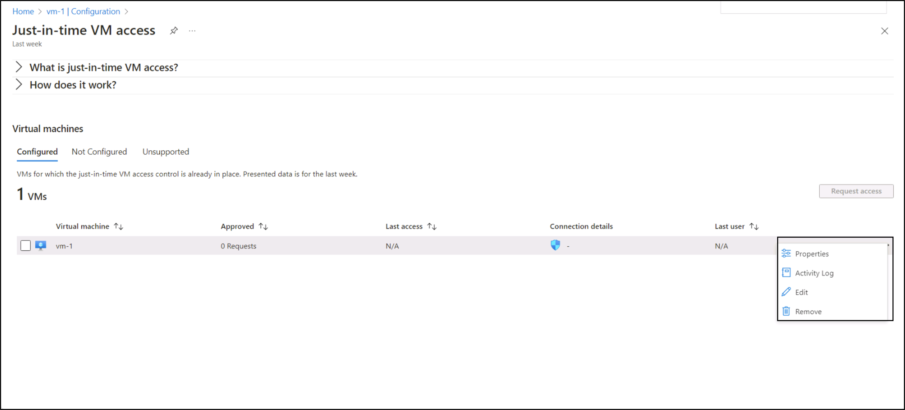

---
lab:
  title: 10 - 在 VM 上啟用 Just-In-Time 存取
  module: Module 03 - Configure and manage threat protection by using Microsoft Defender for Cloud
---

# 實驗室 10：在 VM 上啟用 Just-In-Time 存取

# 學生實驗室手冊

## 實驗案例

身為金融服務公司的 Azure 安全性工程師，您負責保護 Azure 資源，包括裝載重要應用程式的虛擬機器 （VM）。 安全團隊發現，對 VM 的持續開放存取會增加暴力攻擊和未經授權存取的風險。 為了緩解這種情況，資訊安全長 （CISO） 已要求您在用於處理財務交易的特定 Azure VM 上啟用即時 （JIT） VM 存取。

## 實驗室目標

在本實驗室中，您將完成下列練習：

- 練習 1：從 Azure 入口網站 在 VM 上啟用 JIT。

- 練習 2：從 Azure 入口網站 要求存取已啟用 JIT 的 VM。

## 練習指示 

### 練習 1：從 Azure 虛擬機器在 VM 上啟用 JIT

>**附註**： 您可以從 Azure 入口網站的 Azure 虛擬機器頁面在 VM 上啟用 JIT。

1. 在入口網站頂端的搜尋方塊中，輸入「虛擬機器」****。 在搜尋結果中，選取 [**虛擬機器**]。

2. 選取 [myVM]****。
 
3. 從 myVM 的 **[設定 **] **區段選取 [**組態**]。**
   
4. 在 [Just-In-Time VM 存取] 底下 **，** 選取 **[啟用 Just-In-Time]。**

5. 在 [Just-in-time VM 存取] 底下 **，** 按一下 [開啟適用於雲端的 Microsoft Defender] 連結 **。**

6. 根據預設，VM 的 Just-In-Time 存取會使用下列設定：

   - Windows 機器
   
     - RDP 連接埠：3389
     - 最多允許存取：三小時
     - 允許的來源 IP 位址：任何

   - Linux 機器
     - SSH 連接埠: 22
     - 最多允許存取：三小時
     - 允許的來源 IP 位址：任何
   
7. 根據預設，VM 的 Just-In-Time 存取會使用下列設定：

   - 從已設定**索引**標籤中，以滑鼠右鍵按一下您要新增連接埠的虛擬機器，然後選取編輯。

   
   
   - 在 [JIT VM 存取設定]**** 下方，您可以對於已經保護的連接埠編輯現有設定，也可以新增自訂連接埠。
   - 當連接埠編輯完成時，請選取 [儲存]****。   

### 練習 2：從 Azure 虛擬機器的連線頁面要求存取已啟用 JIT 的 VM。

>**附註**： 當虛擬機器已啟用 JIT 時，您必須要求存取權才能連線到它。 無論您透過何種方式啟用 JIT，都能以任何支援的方式要求存取權。
   
1. 在 Azure 入口網站中，開啟虛擬機器頁面。

2. 選取您要連線的 VM，然後開啟 [連線]**** 頁面。

   - Azure 會檢查該 VM 上是否已啟用 JIT。

        - 如果該 VM 未啟用 JIT，系統會提示您啟用。
    
        - 如果已啟用 JIT，請選取 [要求存取]**** 以傳遞存取要求，其中包含對該 VM 設定的要求 IP、時間範圍以及連接埠。
    
   

> **結果**：您已探索如何在 VM 上啟用 JIT，以及如何要求存取適用於雲端的 Microsoft Defender 中已啟用 JIT 的 VM 的各種方法。
